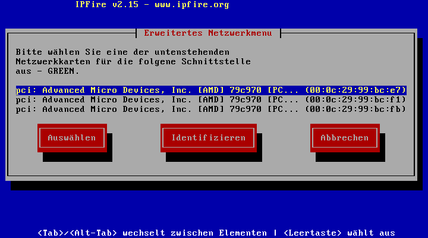

Vorgefertigte virtuelle Maschinen
=================================

Zur Installation in virtuellen Umgebungen liegen für **linuxmuster.net
6.1 Codename Babo** sogenannte `Virtual
Appliances <https://de.wikipedia.org/wiki/Virtual_Appliance>`_ zum
Download bereit. Wir bieten sie im `Open Virtualization Format
(OVF) <https://de.wikipedia.org/wiki/Open_Virtualization_Format>`__ an,
damit sie mit den gängigen Hypervisoren in Betrieb genommen werden
können [#fn1]_.

Auslieferungszustand der VAs
----------------------------

Die IPFire-VA ist identisch mit derjenigen für Version 6.0. Da die
spezifischen Anpassungen erst während des Setups gemacht werden, kann
diesselbe VA für beide Versionen genutzt werden. Die Systeme sind soweit
vorbereitet, dass das initiale
`Setup <http://www.linuxmuster.net/wiki/dokumentation:handbuch:installation:server.setup#setup>`__
ausgeführt werden kann. Es ist jedoch auf jeden Fall zu empfehlen vor
dem
`Setup <http://www.linuxmuster.net/wiki/dokumentation:handbuch:installation:server.setup#setup>`__
gegebenenfalls auf allen Systemen anstehende Aktualisierungen
einzuspielen\ [#fn2]_.

IPFire
~~~~~~

-  Version: 2.17 Release 91, Update-Stand vom 07.07.2015.
-  Netzwerk-Typ: GRÜN - ROT - BLAU.
-  1. Netzwerk-Adapter: intern (GRÜN) 10.16.1.254/12.
-  2. Netzwerk-Adapter: extern (ROT) DHCP.
-  3. Netzwerk-Adapter: wlan (BLAU) 172.16.16.254/24.
-  Festplatte: 5GB (5368709120 Bytes), mit
   IPFire-Standardpartitionierung.
-  RAM: 512MB.
-  Passwort für Konsole und Web: muster.
-  SSH: Dienst ist aktiviert, ebenso Zugriff per Key.
-  Squid: uneingeschr. IP 10.16.1.1 ist eingetragen.

Server mit linuxmuster.net 6.1
~~~~~~~~~~~~~~~~~~~~~~~~~~~~~~

-  Update-Stand vom 07.07.2015 mit linuxmuster-base 6.1.1-0.
-  Betriebssystem: Ubuntu 12.04.5 64Bit.
-  Ein Netzwerk-Adapter: intern (GRÜN) 10.16.1.1/12.
-  Festplatte: 500GB , mit 492GB-Root- und 8GB-Swappartition.
-  RAM: 2048MB.
-  Deutsche Lokalisierung ist bereits eingerichtet.
-  Admin-Account linuxadmin wurde bei der Installation angelegt.
-  root-Account ist aktiviert.
-  Passwort f. root u. linuxadmin: muster.
-  Alle für das Setup notwendigen Pakete sind vorinstalliert, sodass das
   `Setup <http://www.linuxmuster.net/wiki/dokumentation:handbuch:installation:server.setup#setup>`__
   zur Not auch offline durchgeführt werden kann.
-  Trusty-Kernel (Version 3.13.0-xx-generic) ist installiert (Paket
   *linux-generic-lts-trusty*).

Opsi
~~~~

-  Update-Stand vom 07.07.2015 mit linuxmuster-opsi 1.0.3.
-  Betriebssystem: Ubuntu 14.04.1 64Bit\ :sup:``3) <#fn__3>`__`.
-  Ein Netzwerk-Adapter: intern (GRÜN) DHCP.
-  Festplatte: 50GB, mit 48GB-Root- und 2GB-Swappartition.
-  RAM: 2048MB.
-  Admin-Account opsiadmin wurde bei der Installation angelegt.
-  root-Account ist aktiviert.
-  Passwort f. root u. opsiadmin: muster.
-  Opsi-Repositorys von
   `uib <http://www.uib.de/>`__\ :sup:``4) <#fn__4>`__` und
   linuxmuster.net\ :sup:``5) <#fn__5>`__` sind eingebunden.
-  Installierte Opsi-Pakete: *opsi-atftpd*, *opsi-configed*,
   *opsi-depotserver*, *opsi-linux-bootimage*, *opsi-utils*, *opsiconfd*
   und *opsipxeconfd*.
-  Als Hostname ist *opsi*, als Domänenname *localhost.localdomain*
   vorkonfiguriert.
-  Ein selbstsigniertes SSL-Zertifikat für die Organisation
   „Musterschule Musterstadt“ ist erstellt.
-  Die Konfigurationsdatei **/etc/opsi/opsi-product-updater,conf** des
   **opsi-product-updater** ist dergestalt angepasst, dass zusätzlich zu
   den freien
   `uib-Repositories <https://forum.opsi.org/wiki/userspace:packaging_links>`__
   das freie Repository von
   `opsi.disconnected-by-peer.at <http://opsi.disconnected-by-peer.at/public/>`__,
   das zahlreiche freie Opsi-Pakete vorhält, konfiguriert ist.

Download
--------

Die VAs enthalten nur freie Software\ :sup:``6) <#fn__6>`__` und dürfen
kopiert und weitergegeben werden. Sie sind in Tar-Archive gepackt und
können unter Windows zum Beispiel mit 7-Zip entpackt werden. Unter Linux
findet man eine entsprechende Option im Kontextmenü des Dateimanagers
oder entpackt sie auf der Konsole:

.. code:: code

    tar xf lmn6x-ipfire-20150707.tar.xz
    tar xf lmn61-server-20150707.tar.xz
    tar xf lmn61-opsi-20150707.tar.xz

Dateiname/Link

Größe

MD5-Summe

`lmn61-ipfire-20150707.tar.xz <http://pkg.linuxmuster.net/va/lmn61-ipfire-20150707.tar.xz>`__

602M

``129f6913ab38d31a37afff2d22f27106``

`lmn61-server-20150707.tar.xz <http://pkg.linuxmuster.net/va/lmn61-server-20150707.tar.xz>`__

2,6G

``8191cf20ce135171d0b5e058b3c6d496``

`lmn61-opsi-20150707.tar.xz <http://pkg.linuxmuster.net/va/lmn61-opsi-20150707.tar.xz>`__

1,2G

``3956a05400b74613cc79d31ce0a9e42c``

Import
------

Nach dem Entpacken findet man pro VA drei Dateien im aktuellen
Verzeichnis:

.. code:: code

    lmn6x-ipfire-disk1.vmdk
    lmn6x-ipfire.mf
    lmn6x-ipfire.ovf
    lmn61-opsi-disk1.vmdk
    lmn61-opsi.mf
    lmn61-opsi.ovf
    lmn61-server-disk1.vmdk
    lmn61-server.mf
    lmn61-server.ovf

Die ovf-Datei enthält die Beschreibung der virtuellen Hardware, die
vmdk-Datei die virtuelle Festplatte.

VMware Workstation
~~~~~~~~~~~~~~~~~~

Über den Menüpunkt **File \| Open** wählt man die zu importierende
ovf-Datei. In der sich nun öffnenden Dialogbox **Import Virtual
Machine** ist nur noch Name und Zielverzeichnis anzugeben.

VMware ESXi
~~~~~~~~~~~

Der Import erfolgt über den *vSphere Client*, so dass es nicht notwendig
ist, die Dateien manuell in den ESXi-Datastore hochzuladen. Im Menü
**Datei** wählt man den Befehl **OVF-Vorlage bereitstellen** und startet
so einen Assistenten, der weitgehend selbsterklärend ist.

VirtualBox
~~~~~~~~~~

Der Menüpunkt **Datei \| Appliance importieren** öffnet einen
Dateiauswahldialog, mit dem man die entsprechende ovf-Datei auswählt. Im
nächsten Fenster **Appliance-Einstellungen** muss der Name und ggf. das
Gast-Betriebssystem angepasst werden. Ganz unten in der Liste findet
sich unter **Virtuelles Plattenabbild** die Möglichkeit das
Zielverzeichnis zu ändern.

KVM
~~~

In KVM-Umgebungen ist es nicht möglich ovf-Dateien zu importieren. Man
kommt also nicht umhin mit den jeweiligen Bordmitteln virtuelle
Maschinen zu erzeugen. Die vmdk-Dateien können jedoch direkt als
Festplattenimages genutzt werden. Das Kommandozeilen-Tool **qemu-img**
aus dem Paket **qemu-utils** ermöglicht zudem die Umwandlung in andere
Formate\ :sup:``7) <#fn__7>`__`:

-  RAW-Format:

   .. code:: code

           qemu-img convert -f vmdk -O raw lmn61-server-disk1.vmdk lmn61-server-disk1.raw

-  QCOW2-Format:

   .. code:: code

           qemu-img convert -f vmdk -O qcow2 lmn61-server-disk1.vmdk -o preallocation=metadata,compat=1.1,lazy_refcounts=on lmn61-server-disk1.qcow2

Inbetriebnahme IPFire und Server
--------------------------------

Etwaige Fehlermeldung beim ersten Start der virtuellen Maschinen sind
normal und können ignoriert werden. Da noch kein Setup durchgeführt
wurde, sind einige Dienste noch nicht vollständig konfiguriert.

Die Inbetriebnahme lässt sich in kurzer Zeit mit den im Folgenden
dokumentierten Arbeitsschritten durchführen.

IPFire: Netzwerkkarten zuordnen
~~~~~~~~~~~~~~~~~~~~~~~~~~~~~~~

Zur Inbetriebnahme des IPFire müssen Passwörter und
Netzwerkkarten-Zuordnung neu konfiguriert
werden\ :sup:``8) <#fn__8>`__`:

#. Einloggen auf der IPFire-Konsole als **root** mit Passwort
   **muster**.
#. Starten des Einrichtungsprogramms durch Eingabe des Befehls
   **setup**. |image0|

#. Passwortänderung für den Konsolenadministrator **root** und den
   Webadministrator **admin** über die entsprechenden Menüpunkte im
   Hauptmenü unten. |Bild|
#. Im Untermenü **Netzwerk** den Punkt **Treiber- und
   Karten-Zuordnungen** wählen. |Bild|
#. Hier nacheinander die Karten für **GRÜN** (1. Karte), **ROT** (2.
   Karte) und **BLAU** (3. Karte) zuordnen. |Bild| |Bild|
#. Abschließen der Zuordnung mit **Fertig**. |Bild|

IPFire: Internetverbindung einrichten
~~~~~~~~~~~~~~~~~~~~~~~~~~~~~~~~~~~~~

Falls eine statische Adresse für die Internetverbindung notwendig ist,
müssen die
`Adresseinstellungen <http://wiki.ipfire.org/de/installation/start#netzwerk>`__
für das rote Interface angepasst werden. Verteilt der Router Adressen
per DHCP, ist an dieser Stelle nichts zu tun.

IPFire: Aktualisierungen einspielen
~~~~~~~~~~~~~~~~~~~~~~~~~~~~~~~~~~~

Jetzt spielt man die anstehenden
`Updates <http://www.linuxmuster.net/wiki/dokumentation:handbuch:maintenance:ipfire.updates>`__
ein. Da man sich sowieso gerade auf der IPFire-Konsole befindet, kann
man das gleich mit dem Befehl

.. code:: code

    # pakfire upgrade -y

erledigen.

Server: Aktualisierungen durchführen
~~~~~~~~~~~~~~~~~~~~~~~~~~~~~~~~~~~~

Nachdem die Server-VA hochgefahren wurde, empfiehlt es sich zunächst das
System `auf den neuesten
Stand <http://www.linuxmuster.net/wiki/dokumentation:handbuch61:maintenance:securityupdates>`__
zu bringen. Ebenso sollte, falls nicht schon geschehen, auf `einen
trusty-kernel <http://www.linuxmuster.net/wiki/dokumentation:handbuch61:maintenance:securityupdates#aktualisierung_auf_einen_trusty-kernel>`__
aktualisiert werden.

Das Passwort des Benutzers ``linuxadmin`` und ``root`` müssen neu
gesetzt werden:

.. code:: code

    # passwd
    # passwd linuxadmin

Server: Partitionierung anpassen
~~~~~~~~~~~~~~~~~~~~~~~~~~~~~~~~

Die vorgefertigte virtuelle Maschine besteht aus einer root- und einer
Swappartition. Empfohlen wird je nach Schulgröße, ``/home`` ``/var`` und
``/var/spool/cups`` als eigene Partitionen zu führen, weil die ersten
beiden quotiert sein sollten, während letztere nicht quotiert sein
sollte. Zudem enthält ``/var`` zum Teil große Datenmengen durch Linbo.
Die Installation auf der Rootpartition selbst benötigt nur ca. 3-5 GB.
Möglicherweise nötige Schritte:

-  Rootpartition verkleinern, evtl. LV verkleinern
-  Partitionen für ``/home`` und ``/var`` erstellen (in eigenen LVs oder
   nicht)
-  Quotierung unter “/“ löschen und unter “/home“ und “/var“ anlegen

Eine Schritt-für-Schritt Anleitung für einen KVM Virtualisierer findet
man `im
Anwenderwiki <http://www.linuxmuster.net/wiki/anwenderwiki:virtualisierung:kvm:kvm_storage>`__.

Server: Setup durchführen
~~~~~~~~~~~~~~~~~~~~~~~~~

Nun ist das System soweit vorbereitet, dass man das `initiale
Setup <http://www.linuxmuster.net/wiki/dokumentation:handbuch:installation:server.setup#setup>`__
des linuxmuster.net-Systems durchführen kann. Nach diesem Schritt ist
das System einsatzbereit.

Server: Daten migrieren
~~~~~~~~~~~~~~~~~~~~~~~

Ist eine `Migration zuvor gesicherter
Serverdaten <http://www.linuxmuster.net/wiki/dokumentation:handbuch:start#migration_der_firewall_des_servers_und_der_daten>`__
vorgesehen, führt man diese als letzten Schritt der Inbetriebnahme
durch.

Opsi-VA integrieren
-------------------

Will man die Vorteile des Softwareverteilsystems nutzen, ist zusätzlich
noch die Opsi-VA zu integrieren. Folgende Schritte sind dabei
auszuführen:

Vorbereitung auf dem Server
~~~~~~~~~~~~~~~~~~~~~~~~~~~

Vor dem ersten Start der Opsi-VA muss diese auf dem Server importiert
werden. Ermitteln Sie die MAC-Adresse der Maschine und erzeugen Sie
einen entsprechenden Eintrag in der Datei
*/etc/linuxmuster/workstations*. Beachten Sie dabei, dass

-  die IP-Adresse der opsi-Maschine **im 1., 2. und 3. Oktett der
   Server-IP entspricht und im 4. Oktett eine 2 enthält** (zum Beispiel
   **10.16.1.2**), und
-  der Hostname **opsi** lauten muss.

Ein Opsi-Eintrag könnte zum Beispiel so aussehen:

.. code:: code

    srv;opsi;none;52:54:00:AA:BB:CC;10.16.1.2;;;;;0;0

Raumbezeichnung (Feld 1) und Gruppe (Feld 3) sind dabei frei wählbar. Da
die Maschine nicht von **Linbo** verwaltet wird, setzen Sie das PXE-Flag
auf *0* (Feld 11).

Nach dem Durchlauf von

.. code:: code

    # import_workstations

kann die Opsi-Maschine gestartet werden.

Vorbereiten der opsi-VA
~~~~~~~~~~~~~~~~~~~~~~~

Da die Maschine jetzt importiert ist, können Sie die nun folgenden
Konfigurationsschritte auch per SSH ausführen:

-  Loggen Sie sich als Nutzer *root* auf dem opsi-System ein.
-  Aktualisieren Sie zuerst das System:

.. code:: code

        # apt-get update && apt-get dist-upgrade

-  Bereiten Sie anschließend das opsi-System für das Setup vor und
   vergeben Sie neue Passwörter für die Nutzer *root* und *opsiadmin*.
   Das erledigt der Befehl *linuxmuster-opsi –prepare* in einem
   Aufwasch:

.. code:: code

        # linuxmuster-opsi --prepare
        
        ##########################################################
        # linuxmuster-opsi prepare # Fr 7. Mär 10:44:24 CET 2014 #
        ##########################################################
        
        Looking for installed opsi packages ...
         * opsi-depotserver installed ok.
         * opsi-configed installed ok.
         * opsi-atftpd installed ok.
        ...
        
        [5] [Mär 07 10:45:54] Setting rights on directory '/home/opsiproducts' (opsi-setup|621)
        [5] [Mär 07 10:45:54] Setting rights on directory '/var/log/opsi' (opsi-setup|621)
        [5] [Mär 07 10:45:54] Setting rights on directory '/etc/opsi' (opsi-setup|621)
        [5] [Mär 07 10:45:54] Setting rights on directory '/var/lib/opsi' (opsi-setup|621)
        [5] [Mär 07 10:45:57] Setting rights on directory '/var/lib/opsi/depot' (opsi-setup|621)
        Stopping opsi config service....   (done).
        Starting opsi config service.......   (done).
        Stopping opsi pxe configuration service...   .(done).
        Starting opsi pxe configuration service.....   (done).
        
        ### root password ###
        Please enter password for root: 
        Please re-enter password for root: 
        
        ### opsiadmin password ###
        Please enter password for opsiadmin: 
        Please re-enter password for opsiadmin: 
        
        The OPSI system has been successfully prepared.
        Please invoke now on the server this command:
        # linuxmuster-opsi --setup --first
        
        ##########################################################
        # linuxmuster-opsi prepare # Fr 7. Mär 10:46:39 CET 2014 #
        ##########################################################
        

-  Im Zuge dieses Schrittes wird eine Distributionsaktualisierung
   durchgeführt und überprüft, ob alle erforderlichen Opsi-Pakete
   korrekt installiert sind. Falls dabei der Kernel aktualisiert wurde,
   ist ein Neustart der Maschine notwendig.

Abschließendes Setup auf dem Server
~~~~~~~~~~~~~~~~~~~~~~~~~~~~~~~~~~~

Die abschließende Aktion zur Einrichtung des Opsi-Systems muss wieder
auf dem Server erledigt werden. Der Befehl

.. code:: code

    # linuxmuster-opsi --setup --first --password=<passwort>

-  richtet eine passwortlose zertifikatsbasierte SSH-Verbindung für den
   Server-Nutzer root zum opsi-System ein,
-  lädt die Setupinformationen\ :sup:``9) <#fn__9>`__` des
   linuxmuster.net-Systems auf den Opsi-Server hoch,
-  passt dort ggf. den Internet-Domänennamen an und
-  erstellt die SSH- und SSL-Zertifikate neu.

Mit dem Passwort-Parameter übergeben Sie das Root-Passwort des
Opsi-Systems. Diesen Parameter können Sie auch weglassen. Dann wird das
Passwort abgefragt aber nicht auf der Konsole ausgegeben.

Nachdem der Befehl durchgelaufen ist, ist das Opsi-System
betriebsbereit.

Gasttreiber installieren
------------------------

Zur Verbesserung der Performanz empfiehlt es sich auf Server- und
Opsi-VA die
`VirtualBox-Gasterweiterungen <http://wiki.ubuntuusers.de/VirtualBox/Installation#Gast-Erweiterungen>`__
bzw. die `VMware-Tools <http://wiki.ubuntuusers.de/VMware/Tools>`__ zu
installieren. Auf KVM-basierten Systemen entfällt dieser Schritt, da der
Linuxkernel die benötigten Treiber schon mit an Bord hat.

Ein Sonderfall ist IPFire, für den es nur Treiber für VMware gibt. Die
`Open VMware
Tools <http://wiki.ipfire.org/de/addons/virtualisation/howto/open_vmware_tools>`__
werden mit Hilfe von
`Pakfire <http://wiki.ipfire.org/de/configuration/ipfire/pakfire/start>`__
installiert. KVM-Treiber sind wie bei anderen aktuellen Linuxsystemen
automatisch integriert.

.. rubric:: Footnotes

.. [#fn1] Einen größeren, wenn auch nicht umfassenen Überblick gibt das Anwenderwiki `Virtualisierung von linuxmuster.net <http://www.linuxmuster.net/wiki/anwenderwiki:virtualisierung:start>`_

.. [#fn2] s. `IPFire aktualisieren <http://www.linuxmuster.net/wiki/dokumentation:handbuch:maintenance:ipfire.updates>`__ und `Sicherheitsupdates einspielen <http://www.linuxmuster.net/wiki/dokumentation:handbuch:maintenance:securityupdates>`_

.. [#fn3] Vgl. `opsi Getting Started Abschn. 3.1.2 Installation auf einem Debian / Ubuntu System <http://download.uib.de/opsi4.0/doc/html/opsi-getting-started/opsi-getting-started.html#opsi-getting-started-installation-base-deb>`__.  

.. [#fn4] Siehe Datei */etc/apt/sources.list.d/opsi.list*

.. code:: code

    deb http://download.opensuse.org/repositories/home:/uibmz:/opsi:/opsi40/xUbuntu_14.04 ./ 
    deb-src http://download.opensuse.org/repositories/home:/uibmz:/opsi:/opsi40/xUbuntu_14.04 ./

.. [#fnt__5] Siehe Datei */etc/apt/sources.list.d/lmn.list*

.. code:: code

    deb http://pkg.linuxmuster.net/ opsi/
    deb-src http://pkg.linuxmuster.net/ opsi/

.. [#fnt__6] Lizenzierung: linuxmuster.net, Opsi und IPFire
stehen jeweils unter `GPL
3.0 <http://www.gnu.de/documents/gpl.de.html>`__. Die in Ubuntu
enthaltene Software steht jeweils unter der Lizenz, unter der sie
veröffentlicht wurde. Die `Ubuntu License
Policy <http://www.ubuntu.com/about/about-ubuntu/licensing>`__ sieht
vor, dass die Lizenz einer in Ubuntu enthaltenen Software die freie
Weitergabe erlauben muss.

.. [#fnt__7] s. `Qemu-Howto <http://www.linuxforen.de/forums/showthread.php?141201-Qemu-KVM&p=1022869#post1022869>`__

.. [#fnt__8] vgl. `IPFire-Wiki <http://wiki.ipfire.org/de/start>`__: `Passwörter <http://wiki.ipfire.org/de/installation/start#passwoerter>`__
und `Netzwerk <http://wiki.ipfire.org/de/installation/start#netzwerk>`__

.. [#fnt__9] Die Server-Datei
/var/lib/linuxmuster/network.settings wird nach
/var/lib/linuxmuster-opsi/settings auf den Opsi-Server hochgeladen.

